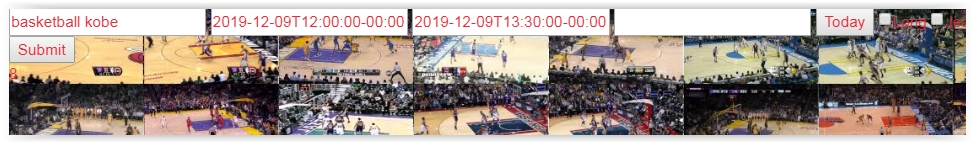
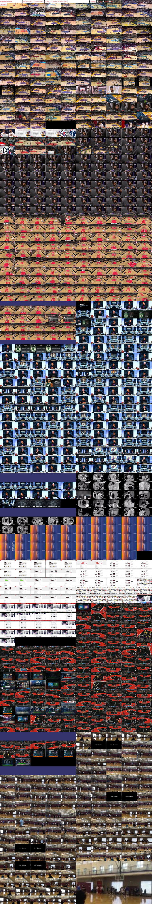

# YouTube Storyboards

One of my absolute most favorite programs I've ever made, if not my favorite. Not as far as showcasing technical prowess (though it does that a lot), but as far as utility as concerned. Nearly tied in the top 2 with my most used applications that I've ever made.

It will get the YouTube Storyboards when you do a YouTube search (which are screenshots of the whole video)

This narrows down your YouTube viewing experience and maybe you find something that is not in the thumbnail. 

Programming saves a LOT OF TIME and it saves a lot of time in the long run by organizing lots of steps, and I can't explain how useful & addicting this was for me.

So you put your search term in the left most input field, and the next two fields are Start Date/Time, and End State Date/Time. The API allows custom date ranges but not native YouTube.

The next field will accept the number of days to move back or forward (ex: -1 or 4) and submit a form to get the next videos.

| File | Purpose |
| ------ | ------ |
| iterate_search.php | You can do your storyboard search here. Clicking on the storyboard will send you to the vide, or you could click the "All" checkbox, and it then clicking on the storyboard will show all videos from that user on another page at iterate_youtube.php |
| iterate_youtube.php | show all users videos' storyboards |
| iterate_bookmarklet.php | this is what actually gets the storyboards, and it's called by ajax |

